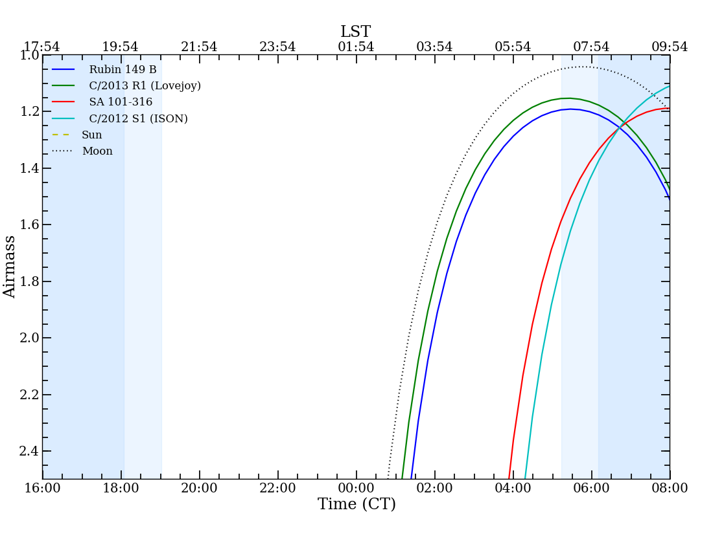

mskpy v3.0.5-dev
============

MSK's personal Python library, mostly for astronomy work.

Requires: python3 (3.5+ recommended), numpy, scipy, astropy v1.2+, FORTRAN compiler.

Recommended: spiceypy (v1.1.0), matplotlib, pyds9.

Caution
=======

I hope you find mskpy useful, but use at your own risk.  When you
encounter errors, feedback would be appreciated.

Configuration
=============

After installation, the file $HOME/.config/mskpy/mskpy.cfg should be
created.  If not simply execute ``python -c 'import mskpy.config'``.
This file currently contains paths to your SPICE kernels, Cohen
mid-IR standards, and IRTF spextool data files. (none are required to
use `mskpy`).

SPICE Kernels
-------------

To use the `ephem` and `observing` modules, `spiceypy` is required.
At a minimum, three kernels are needed to be present in your kernel
directory (as set by the module configuration):
- naif.tls : a leap seconds kernel,
- pck.tpc : a planetary constants kernel,
- planets.bsp : a planetary ephemeris kernel, e.g., DE430.
These kernels are available from the NAIF group at JPL:

  http://naif.jpl.nasa.gov/pub/naif/generic_kernels/

See the `ephem` module documentation for more details.

Examples
========

Solar System observing geometry
-------------------------------

Download 2P/Encke SPICE kernel from JPL HORIZONS; save as
'encke.bsp'::

  >>> from mskpy import getspiceobj
  >>> encke = getspiceobj('encke')
  >>> Earth.observe(encke, '2013-11-01').summary()
  
                               Date: 2013-11-01
                          Time (UT): 00:00:00
                         Julian day: 2456597.50
  
         Heliocentric distance (AU):    0.618
      Target-Observer distance (AU):    0.600
    Sun-Object-Observer angle (deg):  109.105
  
    Sun-Observer-Target angle (deg):   36.038
   Moon-Observer-Target angle (deg):   14.920
  
                            RA (hr):  12:35:04.3
                          Dec (deg): +09:20:03.7
  
         Projected sun vector (deg):  130.751
    Projected velocity vector (deg):  164.120

Which is pretty close to what JPL/HORIZONS reports (note the 15 arcsec
difference in the Equatorial coordinates)::

  rh:        0.618
  Delta:     0.600
  phase:     109.116
  s_elong:   36.041
  l_elong:   14.9
  RA:        12:35:04.1
  Dec:       09:20:20.0
  PsAng-180: 130.755
  PsAMV-180: 344.127

Ephemerides
-----------

  >>> from mskpy import Earth, Moon
  >>> print Moon.ephemeris(Earth, ['2013-1-1', '2013-12-31'], num=365)
        date         ra   dec     rh  delta phase selong
  ---------------- ----- ------ ----- ----- ----- ------
  2013-01-01 00:00 09:25  09:46 0.985 0.003    40    140
  2013-01-02 00:00 10:13  05:35 0.985 0.003    52    128
  2013-01-03 00:00 11:01  01:05 0.984 0.003    63    116
  2013-01-04 00:00 11:50  -3:33 0.984 0.003    75    104
  2013-01-05 00:00 12:40  -8:07 0.983 0.003    88     92
               ...   ...    ...   ...   ...   ...    ...
  2013-12-27 00:00 13:19  -9:42 0.983 0.003   107     73
  2013-12-28 00:00 14:12 -13:21 0.982 0.003   119     61
  2013-12-29 00:00 15:08 -16:23 0.982 0.002   132     48
  2013-12-30 00:00 16:08 -18:32 0.981 0.002   145     35
  2013-12-31 00:00 17:11 -19:29 0.981 0.002   159     21

Read in a HORIZONS CSV formatted table:

  >>> from mskpy.util import horizons_csv
  >>> eph = horizons_csv('horizons_results.txt')
  >>> eph.pprint()
  Date__(UT)__HR:MN col1 col2 R.A._(ICRF/J2000.0) ...  S-O-T   /r  S-T-O  col12
  ----------------- ---- ---- ------------------- ... ------- --- ------- -----
  2016-Dec-01 00:00   --   --         21 15 16.67 ... 66.9358  /T 40.7852    --
  2016-Dec-02 00:00   --   --         21 18 15.10 ... 66.6718  /T 40.6632    --
  2016-Dec-03 00:00   --   --         21 21 13.20 ... 66.4081  /T 40.5404    --
  2016-Dec-04 00:00   --   --         21 24 10.97 ... 66.1445  /T 40.4166    --
  2016-Dec-05 00:00   --   --         21 27 08.40 ... 65.8811  /T 40.2919    --
  2016-Dec-06 00:00   --   --         21 30 05.49 ... 65.6179  /T 40.1663    --
  2016-Dec-07 00:00   --   --         21 33 02.23 ... 65.3549  /T 40.0398    --
  2016-Dec-08 00:00   --   --         21 35 58.62 ...  65.092  /T 39.9126    --
  2016-Dec-09 00:00   --   --         21 38 54.65 ... 64.8293  /T 39.7845    --
  2016-Dec-10 00:00   --   --         21 41 50.33 ... 64.5666  /T 39.6556    --
  2016-Dec-11 00:00   --   --         21 44 45.65 ...  64.304  /T  39.526    --
  2016-Dec-12 00:00   --   --         21 47 40.61 ... 64.0414  /T 39.3956    --
  2016-Dec-13 00:00   --   --         21 50 35.20 ... 63.7789  /T 39.2645    --
  2016-Dec-14 00:00   --   --         21 53 29.44 ... 63.5163  /T 39.1326    --
  2016-Dec-15 00:00   --   --         21 56 23.32 ... 63.2537  /T 39.0001    --
  2016-Dec-16 00:00   --   --         21 59 16.84 ... 62.9909  /T 38.8667    --
  2016-Dec-17 00:00   --   --         22 02 10.01 ... 62.7281  /T 38.7327    --
  2016-Dec-18 00:00   --   --         22 05 02.84 ... 62.4652  /T 38.5979    --
  2016-Dec-19 00:00   --   --         22 07 55.34 ... 62.2022  /T 38.4624    --
  2016-Dec-20 00:00   --   --         22 10 47.50 ... 61.9391  /T 38.3262    --
  2016-Dec-21 00:00   --   --         22 13 39.33 ... 61.6758  /T 38.1892    --
  2016-Dec-22 00:00   --   --         22 16 30.83 ... 61.4124  /T 38.0515    --
  2016-Dec-23 00:00   --   --         22 19 22.02 ... 61.1489  /T  37.913    --
  2016-Dec-24 00:00   --   --         22 22 12.90 ... 60.8853  /T 37.7738    --
  2016-Dec-25 00:00   --   --         22 25 03.47 ... 60.6216  /T 37.6339    --
  2016-Dec-26 00:00   --   --         22 27 53.73 ... 60.3578  /T 37.4932    --
  2016-Dec-27 00:00   --   --         22 30 43.70 ... 60.0939  /T 37.3518    --
  2016-Dec-28 00:00   --   --         22 33 33.36 ... 59.8299  /T 37.2097    --
  2016-Dec-29 00:00   --   --         22 36 22.74 ... 59.5658  /T 37.0669    --
  2016-Dec-30 00:00   --   --         22 39 11.83 ... 59.3016  /T 36.9235    --
  2016-Dec-31 00:00   --   --         22 42 00.64 ... 59.0374  /T 36.7793    --

Flux estimates
--------------

Asteroid
^^^^^^^^

Two methods:

A) Thermal emission from (24) Themis.  If you are not using SPICE, but
   know ``rh``, ``delta``, and ``phase``::

      >>> import astropy.units as u
      >>> from mskpy.models import NEATM
      >>> geom = dict(rh=2.741 * u.au, delta=3.317 * u.au, phase=15.5 * u.deg)
      >>> themis = NEATM(198 * u.km, 0.067, G=0.19, eta=1.0)
      >>> print themis.fluxd(geom,  [0.55, 3.0, 10] * u.um, unit=u.Jy)
      [  6.43548331e-42   9.33984255e-05   6.19350889e+00] Jy

B) Thermal emission and/or reflected light from (24) Themis.  Download
   its SPICE kernel from JPL HORIZONS; save as '2000024.bsp'::

      >>> import astropy.units as u
      >>> from mskpy import Asteroid, SpiceState, Earth
      >>> themis = Asteroid(SpiceState(2000024), 198 * u.km, 0.067, G=0.19, eta=1.0)
      # Thermal + Reflected
      >>> print themis.fluxd(Earth, '2013-10-15', [0.55, 3.0, 10] * u.um, unit=u.Jy)
      [ 0.03174409  0.01327644  6.19537937] Jy
      # Thermal only
      >>> print themis.fluxd(Earth, '2013-10-15', [0.55, 3.0, 10] * u.um, unit=u.Jy, reflected=False)
      [  6.46956946e-42   9.34730285e-05   6.19402381e+00] Jy
      # Reflected only
      >>> print themis.fluxd(Earth, '2013-10-15', [0.55, 3.0, 10] * u.um, unit=u.Jy, thermal=False)
      [ 0.03174409  0.01318297  0.00135556] Jy

Comet coma
^^^^^^^^^^

Download 2P/Encke SPICE kernel from JPL HORIZONS; save as 'encke.bsp'.
Download *Spitzer Space Telescope* kernel from JPL NAIF; save as
'spitzer.bsp'::

  >>> import astropy.units as u
  >>> from mskpy import Coma, SpiceState, Spitzer
  >>> Afrho1 = 8.9 * u.cm * 2.53**2
  >>> encke = Coma(SpiceState('encke'), Afrho1, ef2af=3.5, Tscale=1.1)
  >>> print encke.fluxd(Spitzer, '2004-06-20 18:35', 23.7 * u.um,
                        rap=12.5 * u.arcsec, unit=u.Jy)
  [ 0.02589534] Jy

Observing
---------

Airmass charts
^^^^^^^^^^^^^^

Create a file with your list of targets [#]_::

  Rubin 149 B,          07:24:18h, -00:33:06d
  C/2013 R1 (Lovejoy),    7 19 hr,   2 32 deg
  SA 101-316,           09h54m52s, -00d18m35s
  C/2012 S1 (ISON),     [[1003203]]

.. [#] In order for the last entry to work, the SPICE kernel for
       comet C/2012 S1 (ISON) must be downloaded and saved as
       '1003203.bsp' in your kernel directory.

Then, execute the following::

  >>> import astropy.units as u
  >>> from mskpy import observing
  >>> targets = observing.file2targets('targets.txt')
  >>> telescope = observing.Observer(-110.791667 * u.deg, 32.441667 * u.deg, -7, None)
  >>> observing.am_plot(targets, telescope)

Polarimetry
-----------

Aperture polarimetry from a half-wave plate polarimeter::

  >>> import mskpy.polarimetry as pol
  >>> # fluxes and uncertainties from position angles: 0, 45, 90, and 135:
  >>> I = [1.0, 1.1, 1.0, 1.0]
  >>> sig_I = [0.01, 0.01, 0.01, 0.01]
  >>> p = pol.HalfWavePlate(I, sig_I)
  >>> print 'p = {:.3f} +/- {:.3f} %'.format(p.p, p.sig_p)
  >>> print ' at {:.1f} +/- {:.1f} deg'.format(p.theta, p.sig_theta)
  p = 0.047 +/- 0.007 %
  at 45.0 +/- 4.1 deg

Polarimetry classes can also take arrays for the wave plate positions,
including images.  There are keywords that allow for instrumental
corrections to Q/I, U/I and total polarization.

Contributions
=============

Some code for migration to Python 3 provided by Miguel de Val-Borro.

